Athena
======

Athena is a graphical tool to create and output Threat Intelligence information in various file formats. Currently, TI information can be exported as STIX 1.1 XML files or MISP JSON files.

Athena has been designed to allow the quick and efficient creation of IOC files post-investigation by IR teams – and to allow those files to be created in various formats. This enables the sharing of intelligence between the IR team and other threat-hunting teams in whatever format is best suited for manual review or ingestion into automated systems.

The Athena program takes manual input of “Incident” details, and then either manual or CSV input of “Observables”, which are the individual IOCs themselves. This collection of incident information and Observables can be saved to a proprietary format (for later editing) and/or exported to a supported format (currently STIX 1.1 XML files or MISP JSON files).

### Program Dependencies and installation

The program requires no special installation. Simply unzip the Athena_Vxx.zip file to a directory, and then run Athena.exe.

Athena is written in C# and targets .NET 4.5, 32-bit. It should run on any Windows operating system on which .NET 4.5 is, or can be, installed.

Program Usage
-------------

Once started, the program will present the user with a blank window:

Choose File -> New to start creating a new “Investigation” and “Observables”.

Choose File -> Open to open a previously saved Athena file.

**Note** – Athena only opens and edits the propriety format to which it saves. It does NOT currently open or edit any of the file types it can export, these are export only.

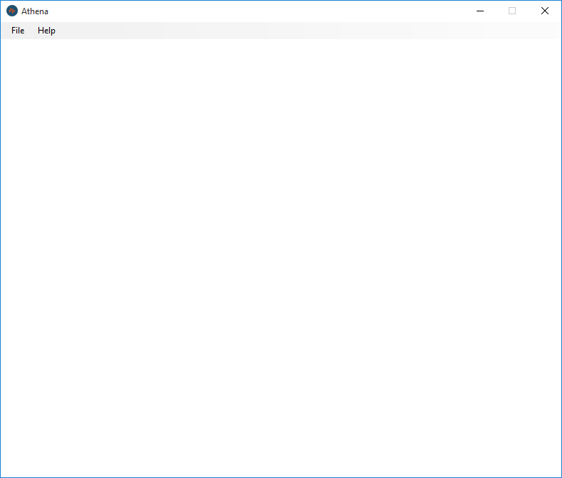

#### Incident Details

Once a new incident has been opened or created, the first step is to check and edit the incident details section of the window:

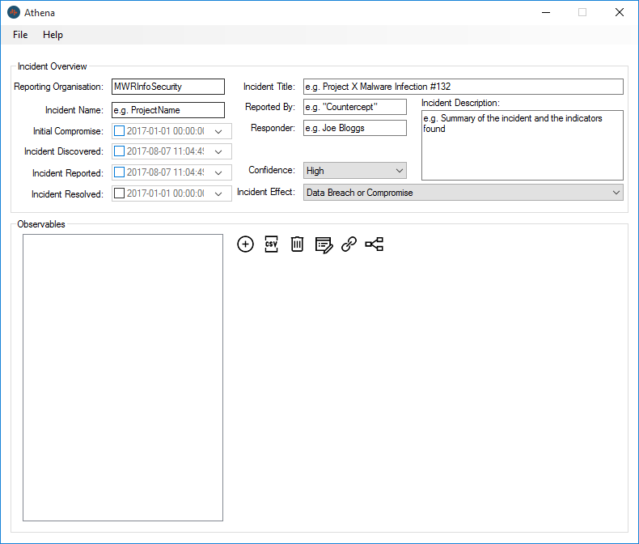

The field names should be self-explanatory, but are open to your interpretation as to their best values for your use case.

**Note** – Some of the fields in the “Incident Overview” section are used to generate the “ID” values of any observables added to this collection. Therefore it is important that all Incident details are completed at this stage **BEFORE** adding any observables - to ensure ID names are consistent in your collection. The program will try to warn you if you miss any values.

Once you have completed the incident details section, click the “Plus” icon to begin adding observables.

#### Manually Adding Observables

Clicking the “Plus” icon will open the “Add/Edit Observable” window.

The first step is to choose the type of observable you wish to add.

Currently the supported types are:
* Domain
* IP Address
* Malware Sample
* Registry

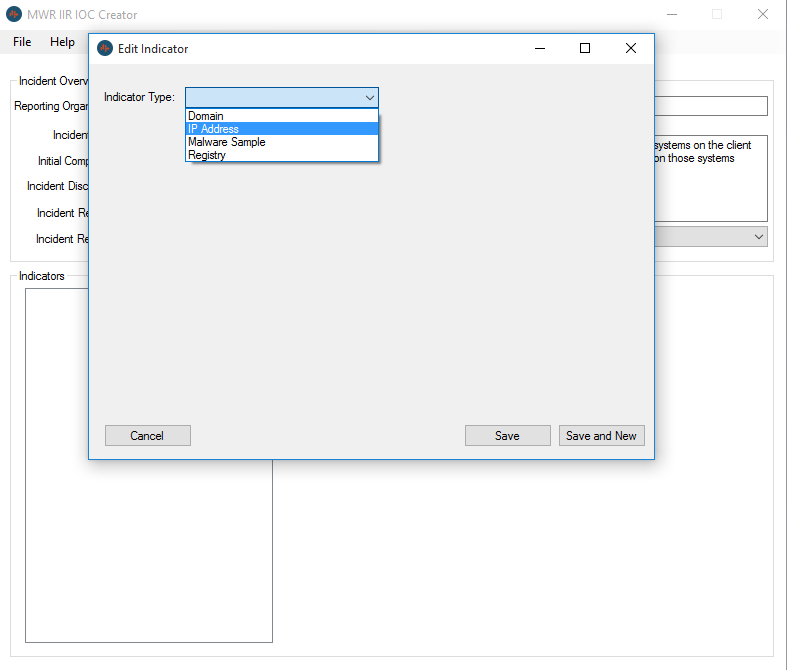

The interface will change dependant on the type of observable you select, displaying on the fields relevant to that observable type.

Fill in the details for your selected observable type.

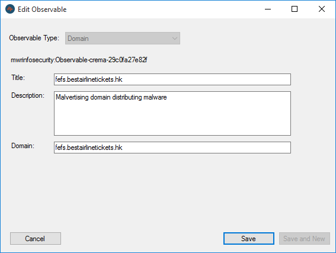

Once done, select “Save” to create the observable and return to the main screen or “Save and New” to save this observable and immediately begin creating a new one.

The “Malware Sample” observable type has an additional feature which allows the user to generate the observable information from the malware file itself.
To use this, select the “Malware Sample” observable type, and then click the “Generate Hashes of a File” button.
Select your malware file, and wait while the hashes are generated.
Complete any missing details and save your observable.

#### Creating Relationships Between Observables

Athena allows observables to be linked together to give context to individual observables. The relationships follow the STIX vocabulary. This may be updated in future versions to allow user-created and more flexible relationships.
To begin linking observables together, click the “Link” Icon on the main window: 

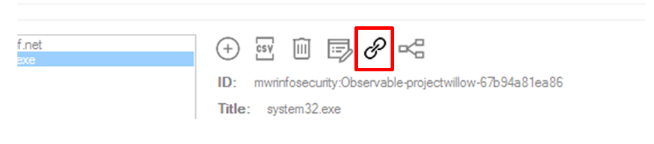

This displays the “Add a Relationship” window.

**Note** – It doesn’t matter which Observable is selected in the main window when you click the “Link” icon, you can add relationships between any observables you like from this window.

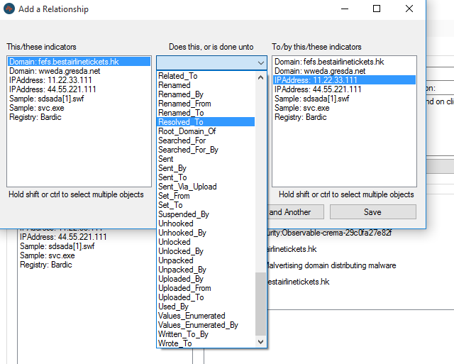

To add a relationship between two or more observables, select one or multiple observables from the left hand box (Hold Control or Shift keys to select multiple observables).

Next, choose the type of relationship you wish to add, by choosing a description from the STIX vocabulary in the drop down menu.

Finally, select the observable or observables from the right hand side, to complete the relationship.

Click “Save” to save the relationship and return to the main window or “Save and Another” to save this relationship and immediately add another one.

**Note** – Multiple relationships are resolved into individual relationships between objects automatically

**Note**– To delete a relationship, choose the observable in the main window, then highlight the relationship you wish to delete in the “Relationships” box. Click the dustbin “Delete” icon on the right side of the relationship box. This relationship will be deleted and any broken relationships automatically resolved.

**Note** – Deleting an observable automatically also deletes any relationships referencing that observable. There is no need to manually delete relationships first.

#### Visualising Relationships

**Note** – This feature is still in development, and will continue to improve.

Athena provides a functionality to visualise the relationships you have created between observables. This allows the user to see the way their observables interact, and also more easily identify “orphaned” observables which do not have any relationships.

Access the visualisation window by clicking the “Relationships” icon on the main window:

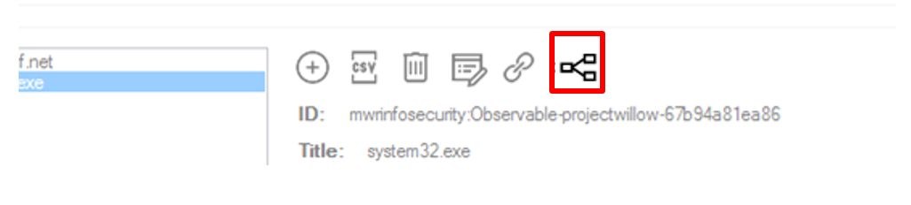

The “Visualise Data” window opens, showing the observables and their relationships.

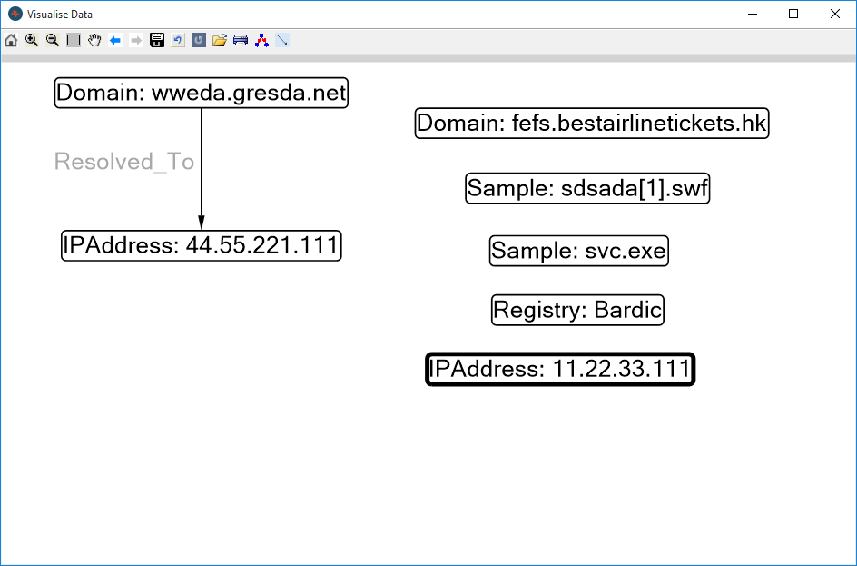

Items can be dragged to rearrange the diagram to more easily see your relationships.

Clicking the Save icon at the top of the window will allow you to save the diagram into an image. 

#### Importing Observables from a CSV

Athena can import observables in bulk from a CSV file. This is useful for bulk loading observables already stored elsewhere and for limiting the number of clicks needed in the interface.

**Note** – The CSV format accepted by Athena is fairly rigid in this iteration. It is planned to relax this and allow on-the-fly mapping of detected columns in the CSV in future versions.

To mass import from a CSV, choose the CSV import icon on the main window:

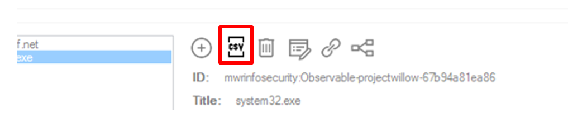

This opens the CSV Import window.

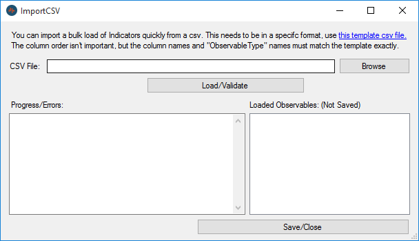

The blue hyperlink opens the template.csv file allowing the user to populate the IOCs they wish to load.

**Note** – the template file is saved in the working directory of the program. If you save any sensitive information to this CSV, remember to clear it afterwards.

The template CSV file is structured as per the screenshot below:

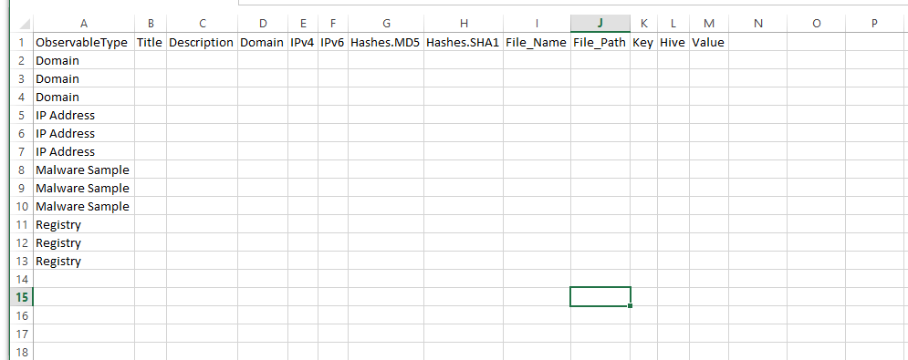

Complete the template as per the example below:

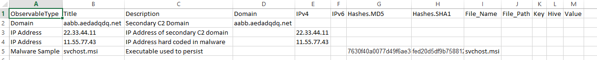

**Note** – The columns displayed across the top of the CSV are all the possible fields for all possible IOC types. The IOC types are displayed down the left hand side in column A. Not all columns apply to all IOC types. Any data supplied in a column which does not apply to that IOC type will be ignored on import. For example, if you supply a value in the “Hashes.MD5” column for an “IP Address” that hash will be ignored.

To import your CSV, save and close the document and choose it in the “Import CSV” window, then press “Load/Validate”.

The loaded observables are displayed in the right hand box. Clicking “Save/Close” will add these to your collection.

Any errors with you CSV will be shown in the box on the left.

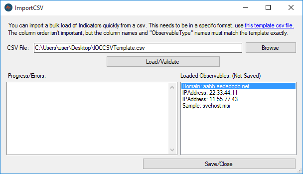

#### Building Relationships and visualising again

Now there are more observables added to our collection, we can build the relationships between them as we did before, and visualise them:

#### Exporting Data

Choose File -> Save to save your collection locally to guard against program crashes and to allow you to edit and re-export your collection later.

When you wish to export to STIX or MISP formats, choose File -> Export and then select your desired format.

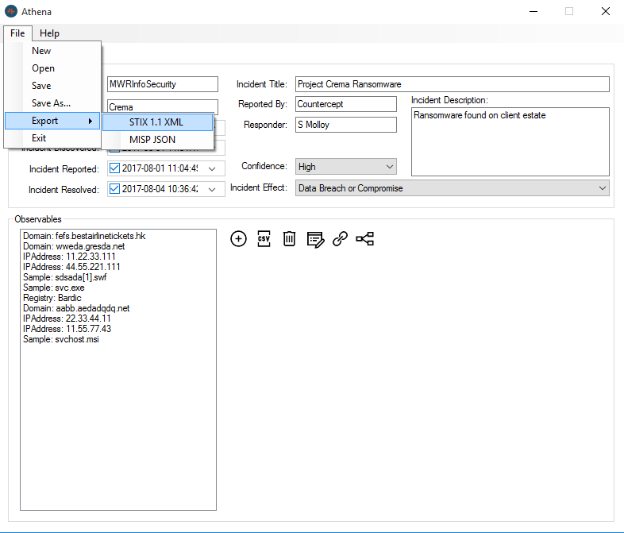

You will be prompted to select the location to save the file, and the export will begin.

Depending on the size of the collection of observables, this may take a few seconds.

Program Information
-------------------

### Program Version History and Change Log
#### Version 0.5 – September 2017
Save/Load format changed.
Various stability and bug fixes

#### Version 0.4 – August 2017
Visualisation functionality upgraded
Program named Athena
Various stability and bug fixes

#### Version 0.02 – June 2017
MISP JSON Support added
Visualisation functionality added
Stability and bug fixes

#### Version 0.01 – April 2017
Initial functionality and program creation.
STIX 1.1 Export support.

### Support
Please contact us with bugs, feature requests or questions. This can be done via the git repo by raising issues or publicly by social media.

